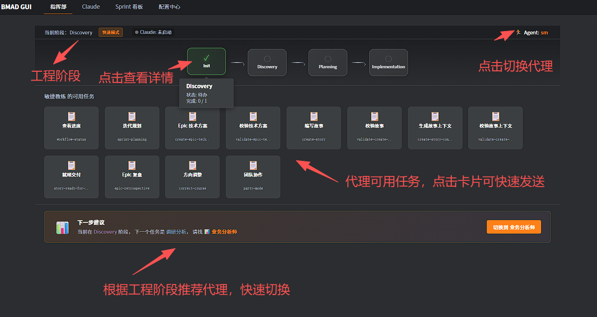
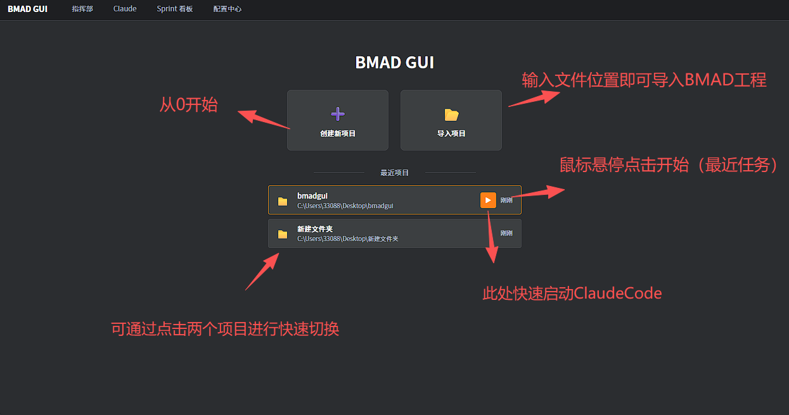
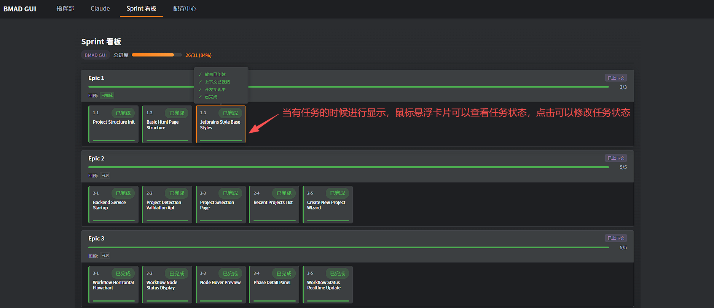
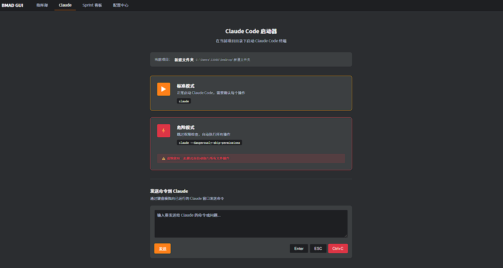

# BMAD GUI

面向 AI 编程新手的可视化辅助开发工具 —— 给 Claude Code 加一个"仪表盘"



## 项目简介

BMAD GUI 是一个轻量级的 Web 界面，帮助用户更直观地管理和推进基于 [BMad Method](https://github.com/bmadcode/bmad-method) 的项目开发流程。它不是替代 Claude Code，而是作为一个可视化外壳，让开发过程更加清晰易懂。

### 解决什么问题？

- **功能盲区** - 不知道 Claude Code 有哪些强大功能可以用
- **方向迷失** - 面对空白的命令行，不知道该做什么、从哪里开始
- **信息过载** - Claude Code 的文字输出多，选项需要手动输入，新手容易迷失
- **进度不可见** - 没有工作状态可视化，不知道当前在哪个阶段

### 如何解决？

**可视化一切：**

1. **工作流可视化** - 横向流程图展示开发阶段（分析→PRD→架构→Epic/Story→开发）
2. **状态可视化** - 四色状态系统（✓绿完成、●蓝进行中、○灰待办、⚠黄问题）
3. **选项可视化** - 把 Claude Code 的文字选项转化为可点击的卡片按钮
4. **功能可视化** - 清晰展示可用的 Agents、Workflows、配置

## 界面预览

### 启动页面

选择或创建 BMAD 项目：



### 引导栏

顶部阶段导航，一眼看清项目进度：


### 任务卡片

把复杂的工作流转化为可点击的任务卡片：


### Sprint 管理

查看和管理 Sprint 中的 Epic 和 Story：




### Claude 交互

向 Claude Code 发送命令：



## 功能特性

- **指挥部界面** - 项目开发的控制中心，一站式管理所有任务
- **工作流追踪** - 实时显示项目进度和当前阶段
- **Agent 管理** - 查看和调用 BMAD 的各种 AI 代理
- **命令执行** - 向 Claude Code 发送命令并获取结果
- **实时更新** - 基于 SSE 的实时状态推送
- **文件监听** - 自动检测项目文件变化

## 快速开始

### 环境要求

- Python 3.8+
- Claude Code CLI（已安装并配置）
- BMAD Method 模块（已安装到项目中）

### 安装步骤

1. **克隆仓库**

```bash
git clone https://github.com/KimJong-cun/bmad-gui.git
cd bmad-gui
```

2. **安装依赖**

```bash
pip install -r bmad-gui/requirements.txt
```

3. **启动服务器**

```bash
python bmad-gui/run.py
```

服务器启动后会自动打开浏览器访问 `http://localhost:8765`

### 命令行参数

```bash
python bmad-gui/run.py [OPTIONS]

选项:
  -p, --port PORT     指定服务端口 (默认: 8765)
  -d, --debug         启用调试模式
  --project PATH      指定项目目录
  --no-browser        不自动打开浏览器
```

## 技术栈

| 组件 | 技术 |
|------|------|
| 后端 | Python + aiohttp 异步服务器 |
| 前端 | Vanilla JS + CSS3（无框架依赖） |
| 通信 | RESTful API + Server-Sent Events (SSE) |
| 存储 | JSON 文件本地持久化 |

### 核心依赖

- `aiohttp` - 异步 HTTP 服务器
- `aiofiles` - 异步文件操作
- `watchfiles` - 高效文件监听（Rust 实现）
- `pyyaml` - YAML 解析
- `pyperclip` - 跨平台剪贴板操作

## 项目结构

```
bmad-gui/
├── run.py              # 启动入口
├── requirements.txt    # Python 依赖
├── src/
│   ├── server.py       # HTTP 服务器
│   ├── config.py       # 配置管理
│   ├── watchers.py     # 文件监听
│   └── handlers/       # API 处理器
│       ├── project.py  # 项目管理
│       ├── agents.py   # Agent 接口
│       ├── workflow.py # 工作流状态
│       ├── story.py    # Story 管理
│       ├── claude.py   # Claude Code 交互
│       └── sse.py      # SSE 推送
└── static/
    ├── index.html      # 主页面
    ├── css/            # 样式文件
    └── js/             # 前端脚本
```

## 使用指南

### 1. 选择项目

首次启动时，选择一个已安装 BMAD Method 的项目目录。

### 2. 工作流导航

通过顶部的阶段导航栏查看项目进度：
- **Phase 0: Research** - 研究与调研
- **Phase 1: Requirements** - 需求分析
- **Phase 2: Design** - 架构设计
- **Phase 3: Implementation** - 开发实现

### 3. 执行任务

点击任务卡片或工作流按钮，命令会自动发送到 Claude Code。

### 4. 查看 Agent

在配置页面查看所有可用的 BMAD Agent 及其功能说明。

## 开发

### 本地开发

```bash
# 启用调试模式
python bmad-gui/run.py --debug

# 指定端口
python bmad-gui/run.py --port 3000
```

### 代码规范

- 后端遵循 PEP 8
- 前端使用原生 JavaScript，无框架依赖
- 异步优先的设计原则

## 相关项目

- [BMad Method](https://github.com/bmadcode/bmad-method) - AI 辅助开发方法论
- [Claude Code](https://claude.ai/code) - Anthropic 的 AI 编程助手

## 更新日志

### v0.0.1 (2024-12-03)

**Bug 修复：**
- 修复 Claude Code 进程检测问题：
  - 修复外部终端启动的 Claude Code 无法被检测到的问题
  - 修复中文路径导致项目匹配失败的问题（使用 ASCII 模糊匹配）
  - 修复关闭 Claude 后状态仍显示"运行中"的问题（排除检测命令自身创建的进程）
- 修复任务卡片显示问题：
  - 未初始化的项目现在只显示"初始化项目"任务，而非所有任务

**改进：**
- 优化 Claude Code 检测逻辑，支持多种检测方式：
  1. 通过 node.exe 进程命令行检测
  2. 通过 cmd.exe 启动命令检测（支持中文路径）
  3. 通过终端窗口标题检测（备用方案）

## 许可证

MIT License

## 贡献

欢迎提交 Issue 和 Pull Request！

---

Made with AI for AI developers
